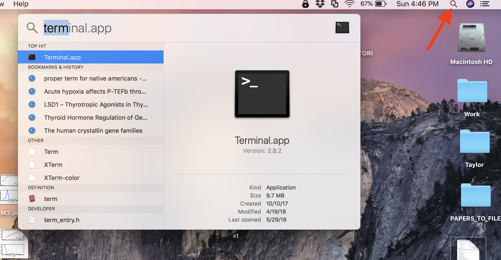
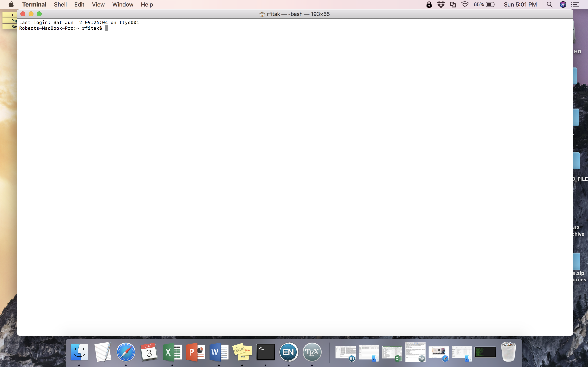

# A Brief Introduction to the UNIX Command Line
With the advent of next-generation sequencing and the era of 'Big Data', it is becoming increasingly necessary for researchers to develop basic computational skills.  As a result, at some point in time you will encounter software that does not run via a convenient and user-friendly graphical user interface (GUI).  Although all of us would love a pretty GUI for every program we use, there are certain advantages to interacting with a computer (e.gs., a personal computer, server, or cluster) via a command line interface. A command line interface often allows for:  
- Increased flexibility
- More parameter choices and options
- More memory efficient
- Easier configuration as operating systems change or get updated
- Sharing of methods (i.e., the code) with others
- Perhaps most importantly, the ability to concatenate multiple software into convenient, streamlined pipelines that can be sent to servers for rapid, large-scale analyses.

## Objectives
Here we will briefly learn how to interact with a UNIX computer via the command line. UNIX is the basis for both Mac and Linux computers, which includes most servers you may encounter. The way to interact with a UNIX computer is called the 'interpreter' or 'SHELL'.  On a Mac or Linux computer the default is called BASH. Although other SHELLs exist, we will use BASH below. Our goals are to learn some fundamental commands to perform many of the same tasks you would normally do on a daily basis, such as:  
1. changing directories (aka, folders): `cd`
2. creating directories: `mkdir`
3. view contents of a directory: `ls`
4. create files: `touch` or `>`
5. copy files: `cp`
6. move or renames files: `mv`
7. open or view files `cat`, `head`, `tail`, `more`, `less`
8. print text to the screen or to files: `echo`
9. remove files or directories: `rm`

Before we begin, you will need to open the 'terminal' on your MacBook Pro computers.  Simply search for \"terminal\" using the magnifying glass in the upper right-hand corner and select the terminal application.  See the red arrow in the image below:  



Did you open the terminal?  If so, it should look something like this:  



Next, simply follow the tutorial below.  The actual commands to enter in the terminal will appear in light grey boxes below.  Although you can copy and paste these commands, we suggest you type them in yourself until you get more familiar with the terminal.  We will learn a few tricks of the trade as we go along as well.
Here we go!!!

### Step 1:  changing directories
Normally, when you open your computer, you start in the Desktop by default.  The Desktop is actually a directory (folder) in your computer's file system.  When you open a new session in the terminal, you most likely will start in a different location.  To find out where your terminal is 'located', enter the command:
```
pwd
```
Make sure to always press the 'enter' (or 'return') key to execute the command.
The terminal should print your current location, or 'path'.  The path starts with the root of the computer file system, or `/`, and then lists various folders inside of folders until you get to your current location.  Most likely this will not be the Desktop.  To change into the Desktop directory, simply enter:
```
cd Desktop
```
Now if you enter the command `pwd`, your location should have changed.  Go ahead and check.  
Next, if you want to back up one level in the directory hierarchy, enter:
```
cd ..
```
The shortcut `..` always means "up one level" in UNIX.  You could always replace the `..` with the full text of the path you want to go.  If you are ever not sure of your location, and want to return to this "Home" location of where started from, then enter:
```
cd ~
```
The `~` always refers to this preset Home location.  Check your location using `pwd`, and then move again into the Desktop (`cd Desktop`).  
Great job so far!!!

### Step 2:  making a directory
First, let's make sure we are back to the `Desktop` directory:
```
cd ~/Desktop
```
It is often the case that you will want to make a new directory, and store a bunch of cool files in it.  This is a really easy task.  Simply enter:
```
mkdir Practice
```
This will make a new directory called "Practice" in the Desktop.  Feel free to change "Practice" to anything you would like.  
### NOTE:  Avoid using spaces in folder or filenames, they can cause a lot of problems.  Use "_" instead!!!
Minimize the terminal and look at your Desktop.  Is your folder there?
Great!  Now move into this new folder:
```
cd Practice
```
Piece of cake, huh!

### Step 3: listing contents
Now we will look at see which directories and files are inside of a folder.  But first, let's move back to the Desktop.
```
cd ../Desktop
```

Now, enter the command:
```
ls
```
The contents of the Desktop should be printed to the screen.  Does this match what you see when you look at the computer's Desktop?  
Now let's look at a more detailed list of the contents:
```
ls -l
```
This lists permissions, owners, sizes, dates, etc. for each item.  
We can also look at all the contents of a different directory:
```
ls -l ..
```
Which directory does this show the contents for?  
What about:
```
ls -l Practice
```
If you are ever not sure how to use a command, you can always use the `man` command for a command's manual, or Google (Googling is a GREAT resource).
```
man ls
```
To exit the manual for ls, enter `q`.
  
---

___Break time!  Let's reconvene for a minute to make sure we are all on the same page___

---  

### Step 4: making files
Before we make some new files, let's move back into our Practice directory:
```
cd Practice
```
Now we can make an empty file called "test.txt" using the `touch` command:
```
touch test.txt
```
Now check the contents of our Practice directory using `ls`.  
How big is this new file? HINT:  use one of the parameters for the `ls` command.  
File names can actually be whatever you want, and don't require an extension like ".txt". For example:
```
touch test2
```
Using an extension like ".txt" is often used to remind the user what type of file you are working with.  Some programs may require it.  
A second method to create a new file is to direct the output of a command to a new file using `>`.  Let's list the full details for the files in our folder and write them to a new file:
```
ls -l > file_details.txt
```
Alternatively, you could write the details for just one of the files:
```
ls -l test2 > test2.details.txt
```
or for the Desktop folder:
```
ls -l .. > Desktop.txt
```
Feel free to check the contents of the folder using the `ls` command, or you can also double click on the folder in the Desktop to compare.

### Step 5: Copying files
To make an identical copy of a file, use:
```
cp Desktop.txt Desktop.copy.txt
```
That's it!  Easy!  
Try making a copy again but placing the copy on the Desktop:
```
cp Desktop.txt ../Desktop.contents.txt
```
Notice the copy is now put in the Desktop directory, and the copy now has a different name.  We will delete it later...  

### Step 6:  Moving or renaming files
To rename a file, you use a similar syntax to the `cp` command above:
```
mv Desktop.copy.txt Desktop.deleteme.txt
```
Now, let's move this renamed file to the Desktop:
```
mv Desktop.deleteme.txt ..
```
Notice again our use of the `..`.  Nice and quick, eh?  Way easier than dragging and dropping, am I right? (OK... we can perhaps agree to disagree.  But if you have to do that operation 10,000 times...?)

### Hint:  You can actually drag and drop files and folders from your GUI into the terminal.  Try it out with the `ls` command and the `Practice` folder if you dare!

---

___Break time!  Let's reconvene for a minute to make sure we are all on the same page___  

---  

### Step 7:  Viewing files
Since you made all those files, why not look at what's inside?  You could always double-click and open them in a text editor, but this would be boring.  There are many ways to open them on the command line, a few are outlined below.  Try what works best for you:  
Print the entire file to the screen (NOTE: Not recommended for very large files)
```
cat Desktop.txt
```

Print the first 10 lines of a file:
```
head Desktop.txt
```

Print the first 5 lines of a file:
```
head -n 5 Desktop.txt
```

Print the last 10 lines of a file:
```
tail Desktop.txt
```

Print the last 3 lines of a file:
```
tail -n 3 Desktop.txt
```

Preview a file one page at a time (the page size is defined by the size of the terminal window):
```
less Desktop.txt
```
While the file is open in `less`, you can scroll up or down the file by using the up or down arrow keys, or move one page at a time using the space key.  However, this file is small so the entire contents are shown.  
Enter `q` to quit the 'less' viewer.

### Step 8:  Printing custom text
You can use the `echo` command to print to the screen:
```
echo "I love NGS"
```
or to write new, custom text into a file:
```
echo "I love NGS" > custom.txt
```
You can then use the `>>` to add new content to the end of an existing file:
```
echo "But Sanger sequencing is cool too" >> custom.txt
```
Feel free to add your own custom content to the file above.  Make sure to view the file above using the `cat` or `less` commands above to make sure you did it correctly!

### Step 9:  Removing files or directories
You can delete a file using the `rm` command:
```
rm custom.txt
```
Is it gone?  Use the `ls` command to check.  
Remove the two files we put into the Desktop:
```
rm ../Desktop.deleteme.txt
rm ../Desktop.contents.txt
```
Are they still on the Desktop?  
Finally, change back into the Desktop and remove the entire `Practice` directory:
```
cd ..
rm -r Practice
```
Is the `Practice` directory still there?  
### Note:  When it is deleted, it is gone for good.  It is not in the trash or Recycle bin.


## Test time!
Now, on your own I want you to:
1. Create a directory in your Desktop called "2020_PRACTICE"
2. Make a file called "sequences.fasta" in this new folder.
3. Write the sequence "ATGCGT" to the file "sequences.fasta"
4. Record the file size in bytes.

___What's your answer?___
_Don't forget to delete the file and folder you made when finished!_

---

### Great job with the tutorial!  Now everyone is a seasoned computer wizard!
Below are some extra tips, commands to check out, and links to additional resources to examine in your free time!

#### Extra features/tips to help you out:
- use the Up-arrow to recall your previous commands
- use the `tab` key to complete the name of a file or program name after typing part of it
- a command is stuck?  Quit the command using `ctrl+c`
- `ctrl+a` to go the beginning of a command line
- `ctrl+e` to go the end of a line
- `ctrl+u` to delete text you have typed at the command line
- Remember, the command line is CASE SENSITIVE, so `file` and `File` are different things!

#### Extra commands you may come across often:

Is your terminal screen a bit cluttered? Use this command:
```
clear
```

Want to see your command history?
```
history
```
Note:  You can also use the "up arrow" as mentioned above

Count the number of lines in a file:
```
wc -l file
```

Search a file for a specific pattern (e.g., ATGC):
```
grep "ATGC" file
```
The above command returns the lines that match the pattern "ATGC"

Show various columns of a tab-delimited file (e.g., a spreadsheet):
```
# Second column
cut -f2 file

# First and fifth column
cut -f1,5 file

# Third through the seventh columns
cut -f3-7 file

# Same as above, but for a comma-delimited file (e.g., csv file)
cut -d"," -f3-7 file.csv
```

  
#### Useful links for additional UNIX tutorials or resources:
- [Another short beginner's tutorial](https://dbsloan.github.io/TS2018/exercises/unix_commands.html)
- [A good set of tutorials](http://www.ee.surrey.ac.uk/Teaching/Unix/)
- [Highly recommended tutorials for beginners to novice, complete with graphics](https://swcarpentry.github.io/shell-novice/)
- [cheat sheet 1](../pdfcheatsheet1.pdf)
- [cheat sheet 2](../pdf/cheatsheet2.pdf)
- [cheat sheet 3](../pdf/cheatsheet3.pdf)
